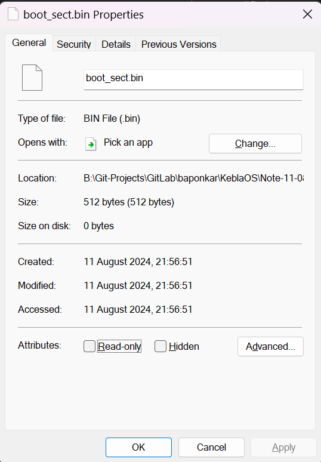
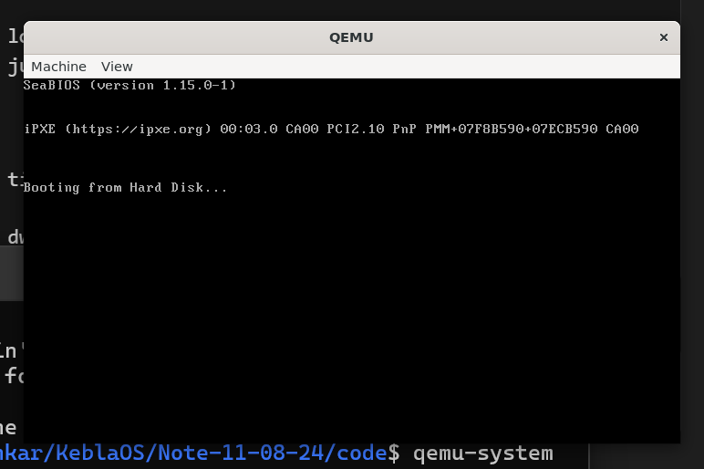
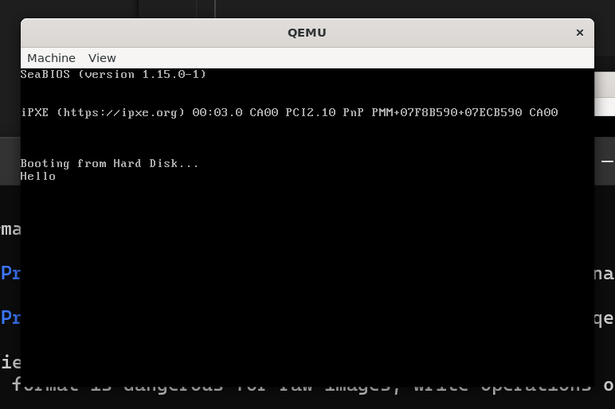
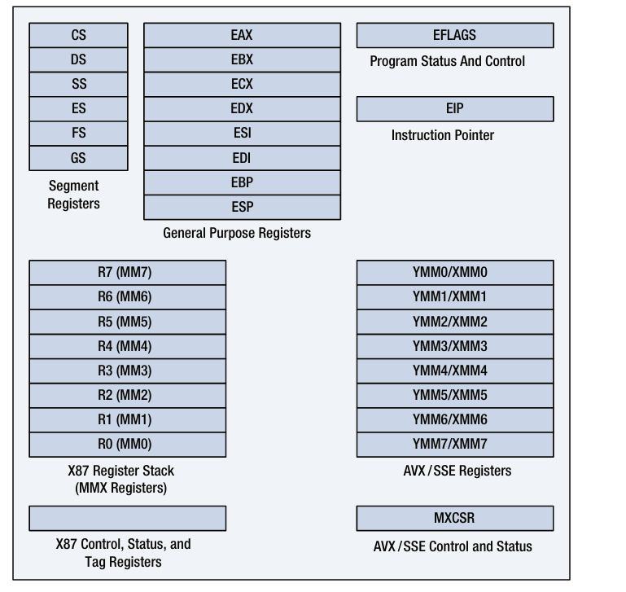
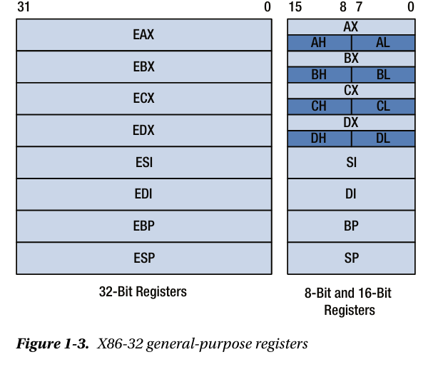
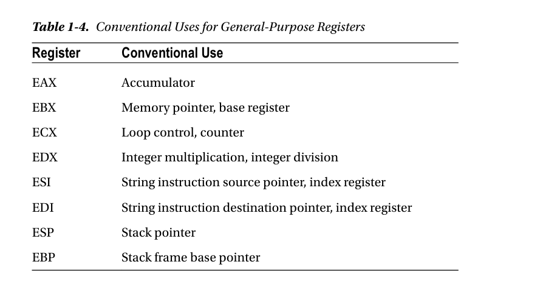
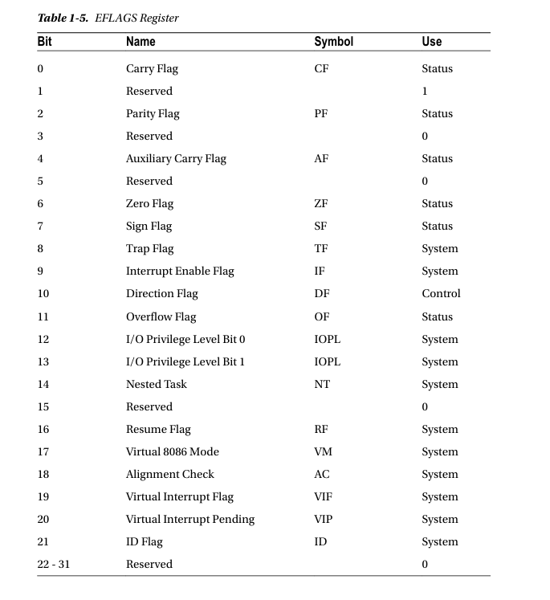
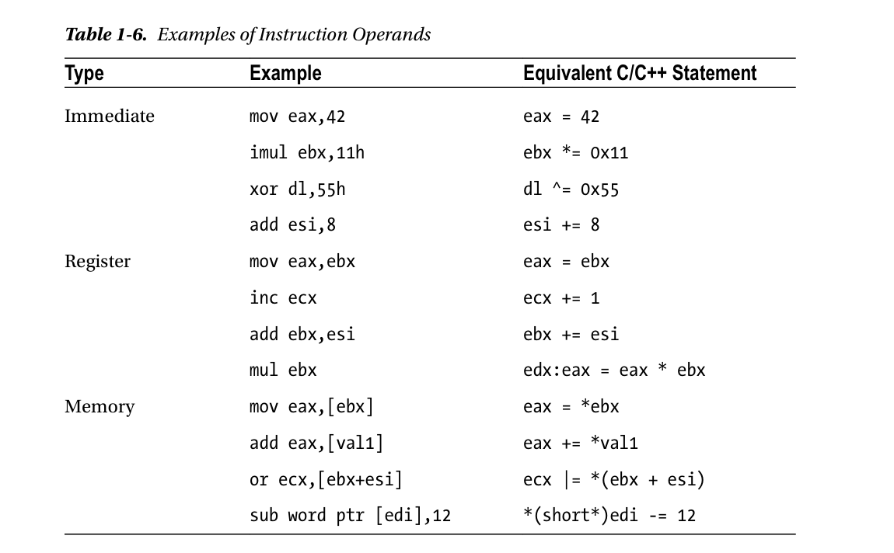

## Note :

Date : 11 th August, 2024


[NASM](https://nasm.us/) stands for Netwide Assembler

* Installing NASM

```bash
sudo apt install nasm
#Test installation
nasm -v
```

* Installing Qemu in Ubuntu
```bash
sudo apt update

#Installing Qemu
sudo apt install qemu qemu-kvm libvirt-daemon-system libvirt-clients bridge-utils

#Start Services
sudo systemctl start libvirtd
sudo systemctl enable libvirtd

#Verify installation
qemu-system-x86_64 --version

```

* Converting asm into binary machine code
Which generating `boot_sect.bin` binary file.

```
nasm boot_sect.asm -f bin -o boot_sect.bin
 ```

 The size of [boot_sect.bin](./code/boot_sect.bin) is exactly 512 byte.
 
 

 `-f bin` tell assember to produce raw machine code rather than a code package.

 # BOOT SECTOR PROGRAMMING (IN 16-BIT REAL MODE)

 ```asm
 ;
 ; A simple boot section programming which loops foreever

 loop :     ;define a label "loop" that will allow us to jump back to it

    jmp loop    ; Using a simple cpu instruction to jump

times 510-($-$$) db 0;

dw 0xaa55   ;magic number
 ```

 * Run the machine code

 ```asm
 qemu-system-x86_64 boot_sect.bin
 ```

 * Output

 

 * Read the binary content of `boot_sect.bin`
 ```bash
 xxd boot_sect.bin
 ```

 * Output 

 ```bash
00000000: ebfe 0000 0000 0000 0000 0000 0000 0000  ................
00000010: 0000 0000 0000 0000 0000 0000 0000 0000  ................
00000020: 0000 0000 0000 0000 0000 0000 0000 0000  ................
00000030: 0000 0000 0000 0000 0000 0000 0000 0000  ................
00000040: 0000 0000 0000 0000 0000 0000 0000 0000  ................
00000050: 0000 0000 0000 0000 0000 0000 0000 0000  ................
00000060: 0000 0000 0000 0000 0000 0000 0000 0000  ................
00000070: 0000 0000 0000 0000 0000 0000 0000 0000  ................
00000080: 0000 0000 0000 0000 0000 0000 0000 0000  ................
00000090: 0000 0000 0000 0000 0000 0000 0000 0000  ................
000000a0: 0000 0000 0000 0000 0000 0000 0000 0000  ................
000000b0: 0000 0000 0000 0000 0000 0000 0000 0000  ................
000000c0: 0000 0000 0000 0000 0000 0000 0000 0000  ................
000000d0: 0000 0000 0000 0000 0000 0000 0000 0000  ................
000000e0: 0000 0000 0000 0000 0000 0000 0000 0000  ................
000000f0: 0000 0000 0000 0000 0000 0000 0000 0000  ................
00000100: 0000 0000 0000 0000 0000 0000 0000 0000  ................
00000110: 0000 0000 0000 0000 0000 0000 0000 0000  ................
00000120: 0000 0000 0000 0000 0000 0000 0000 0000  ................
00000130: 0000 0000 0000 0000 0000 0000 0000 0000  ................
00000140: 0000 0000 0000 0000 0000 0000 0000 0000  ................
00000150: 0000 0000 0000 0000 0000 0000 0000 0000  ................
00000160: 0000 0000 0000 0000 0000 0000 0000 0000  ................
00000170: 0000 0000 0000 0000 0000 0000 0000 0000  ................
00000180: 0000 0000 0000 0000 0000 0000 0000 0000  ................
00000190: 0000 0000 0000 0000 0000 0000 0000 0000  ................
000001a0: 0000 0000 0000 0000 0000 0000 0000 0000  ................
000001b0: 0000 0000 0000 0000 0000 0000 0000 0000  ................
000001c0: 0000 0000 0000 0000 0000 0000 0000 0000  ................
000001d0: 0000 0000 0000 0000 0000 0000 0000 0000  ................
000001e0: 0000 0000 0000 0000 0000 0000 0000 0000  ................
000001f0: 0000 0000 0000 0000 0000 0000 0000 55aa  ..............U.
 ```

 [x86_64](https://en.wikipedia.org/wiki/X86-64) architecture instruction set [reference](https://www.felixcloutier.com/x86/). 


## Printing Hello by Interrupt

```asm
;
; A simple boot sector programme which print message by using BIOS Routine
;

mov ah, 0x0e; int 10/ah = 0eh-> scrolling teletype BIOS routine

mov al, 'H';
int 0x10; Interrupts
mov al, 'e';
int 0x10;
mov al, 'l';
int 0x10;
mov al, 'l';
int 0x10;
mov al, 'o';
int 0x10;

jmp $ ; Jump to the current address foreever

times 510-($-$$) db 0 ; Pad the boot sector out with zeros

dw 0xaa55  ; Last two bytes form the magic number,
            ;; so BIOS knows we are a boot sector.
```

### Output

`qemu-system-x86_64 print_hello.bin`




--------------------------------------------------------
# Note

Date : 12 th August, 2024

# x86_32 internal architecture 



# x86_32 general purpose registers



# Conventional Uses for General-Purpose Registers




# EFLAGS Register



# Examples of Instruction Operands



`Effective Address = BaseReg + IndexReg * ScaleFactor + Disp`

-------------------------------------------------------

* Date : 13th August, 2024

GRUB (GRand Unified Bootloader) is a popular bootloader that is widely used to load and manage multiple operating systems on a computer. It is particularly useful in environments where you need to choose between different OS installations or custom kernels at boot time.

### Key Features of GRUB:
- **Multiboot support:** GRUB can boot multiple operating systems on the same machine.
- **Modular architecture:** GRUB allows you to load different modules to extend its functionality.
- **Filesystem support:** It can read files from various filesystems (like ext4, FAT, NTFS) during the boot process.
- **Command-line interface:** GRUB provides a CLI where you can enter commands to manually boot an OS, troubleshoot, or modify boot parameters.
- **Configuration flexibility:** You can easily modify boot configurations using the `grub.cfg` file or during boot time.

### How to Use GRUB for Your Project

Since you are developing a new GUI Operating System in Assembly and C, you can use GRUB as the bootloader for your OS. Here’s how you can use GRUB in your project:

#### 1. **Installing GRUB:**
   - On Ubuntu, you can install GRUB by running:
     ```bash
     sudo apt-get install grub2
     ```
   - Alternatively, you can install `grub-pc-bin` and `grub-efi-amd64-bin` if you’re dealing with BIOS and UEFI systems respectively.

#### 2. **Creating a Bootable ISO:**
   - Compile your OS kernel and any necessary files.
   - Create a directory structure like this:
     ```
     iso/
     ├── boot/
     │   ├── grub/
     │   │   └── grub.cfg
     │   └── your-kernel.bin
     ```
   - The `grub.cfg` file is the configuration file that tells GRUB how to boot your kernel. Here’s a simple example:
     ```bash
     set timeout=5
     set default=0

     menuentry "My OS" {
         multiboot /boot/your-kernel.bin
         boot
     }
     ```

#### 3. **Generating the ISO:**
   - You can generate a bootable ISO image using the following command:
     ```bash
     grub-mkrescue -o my_os.iso iso/
     ```
   - This will create an ISO file named `my_os.iso` which you can then use with the QEMU emulator.

#### 4. **Testing with QEMU:**
   - Run your OS using QEMU to test it:
     ```bash
     qemu-system-x86_64 -cdrom my_os.iso
     ```

#### 5. **Customizing GRUB:**
   - You can customize the GRUB menu and boot process by editing the `grub.cfg` file. You can add background images, change the font, add multiple entries, etc.

#### 6. **Installing GRUB on a Disk (optional):**
   - If you want to install your OS to a physical disk or a virtual disk, you can install GRUB on that disk to make it bootable.
     ```bash
     sudo grub-install --root-directory=/mnt/ /dev/sdX
     ```
   - Replace `/dev/sdX` with your disk's identifier.

Using GRUB in your OS project gives you a flexible and powerful way to manage the boot process, allowing you to easily boot into your custom OS kernel and eventually load a GUI if that’s part of your OS design.

# required package for generating isoimage
```bash
sudo apt install genisoimage
```

# ELF execuatable files 
The ELF (Executable and Linkable Format) is a common file format for executables, object code, shared libraries, and core dumps in Unix-like operating systems, including Linux. It is the standard binary format used by many systems to manage the execution of programs.

### Key Components of an ELF File:
1. **ELF Header:**
   - The ELF header is located at the beginning of the file and contains metadata about the file, such as the type (executable, shared library, etc.), architecture, entry point address, and the sizes of other sections.

2. **Program Header Table:**
   - This section contains information necessary for the system to create a process image, including segments that need to be loaded into memory, their locations, sizes, and access permissions.

3. **Section Header Table:**
   - The section header table describes the sections in the ELF file. Each section contains different types of data, such as code, data, and relocation information. Common sections include `.text` (code), `.data` (initialized data), and `.bss` (uninitialized data).

4. **Sections:**
   - **.text**: Contains the executable code.
   - **.data**: Contains initialized global and static variables.
   - **.bss**: Contains uninitialized global and static variables.
   - **.rodata**: Contains read-only data, such as string literals.
   - **.symtab**: Symbol table, used by the linker.
   - **.strtab**: String table, used to store the names of symbols.
   - **.rel.text** or **.rela.text**: Relocation information for the `.text` section.

5. **Segments:**
   - Segments are portions of the file that are mapped into memory for execution. They include information about how to load the program, such as where to place code and data in memory.

6. **Dynamic Section (optional):**
   - If the ELF file is a dynamically linked executable, this section contains information used by the dynamic linker to load shared libraries and resolve symbols.

### How ELF Executables Work:
When an ELF executable is loaded by the operating system, the following steps occur:

1. **Loading:**
   - The operating system reads the ELF header to understand the file structure.
   - The program header table is then used to determine which segments of the file should be loaded into memory.
   - These segments are loaded into the appropriate memory locations, as defined in the program header.

2. **Relocation:**
   - If the executable is dynamically linked, the dynamic linker (`ld-linux.so` on Linux) is invoked to resolve external symbols and link shared libraries.

3. **Execution:**
   - Control is transferred to the entry point of the program, which is defined in the ELF header.
   - The program begins execution from this entry point, typically starting in the `main` function or its equivalent.

### Usage in Your Project:
Since you are developing a new GUI Operating System in Assembly and C, understanding and working with ELF executables is essential because:

1. **Compiling and Linking:**
   - Your OS kernel and user programs will likely be compiled into ELF format. Compilers like GCC generate ELF files by default on Linux.

2. **Loading the Kernel:**
   - When creating a bootloader (like GRUB), you’ll need to load your OS kernel, which will be in ELF format, into memory before handing over control to it.

3. **Dynamic Loading:**
   - If your OS supports dynamic libraries, you’ll need to implement or use a dynamic linker to handle ELF files.

4. **Debugging and Development:**
   - Tools like `objdump`, `readelf`, and `gdb` can be used to inspect and debug ELF files during development.

Understanding the ELF format will give you the flexibility to manage executable code within your operating system, load programs, and even create custom loaders if needed.


To Run [Kolibri](https://kolibrios.org/en/) OS

```bash
$ cd /mnt/b/Git-Projects/GitLab/baponkar/KeblaOS/test/kolibri
$ qemu-system-x86_64 -cdrom disk.iso
```

* Date : 14th August, 2024

* [loader.s](./code/loader.s)
```asm
gloabl loader   ;the Entry symbol of ELF

MAGIC_NUMBER equ 0x1BADB002 ;Define the Magic Number
FLAGS equ 0x0   ;multiboot FLAGS
CHECKSUM equ -MAGIC_NUMBER  ;calculate the checksum 
                            ; (magic number + checksum + flags should equal 0)


section .text:    ; start of the text (code) section
align 4           ; the code must be 4 byte aligned
    dd MAGIC_NUMBER ;write the magic number to the machine code,
    dd FLAGS        ;the flags
    dd CHECKSUM     ;the checksum 


loader :    ;the loader label (defined as entry point in linker script)
    mov eax, 0xCAFEBABE ; place the number 0xCAFEBABE in the register eax

.loop :
    jmp .loop ; loop foreever
```

Build elf 32 bit code and generating loader.o :

```bash
nasm-f elf32 loader.s
```

Linking The Kernel

* [link.ld](./code/link.ld)

```
ENTRY(loader)   /*the name of entry label*/

SECTIONS{
    . = 0x00100000; /* the code should be loaded at 1 MB */
    .text ALIGN (0x1000) : /* align at 4 KB */
    {
        *(.text)    /* all text sections from all files */
    }

    .rodata ALIGN (0x1000) : /* align at 4 KB */
    {
        *(.rodata*) /* all read-only data sections from all files */
    }

    .data ALIGN (0x1000) : /* align at 4 KB */
    {
        *(.data) /* all data sections from all files */
    }

    .bss ALIGN (0x1000) :
    {
        *(COMMON) /* all COMMON sections from all files */
        *(.bss) /* all bss sections from all files */
    }
    
}
```

link the link.ld with loader.o

```
ld-T link.ld-melf_i386 loader.o-o kernel.elf
```

The above code will generate `kernel.elf`

Downloading GRUB from [here](https://alpha.gnu.org/gnu/grub/)

Creating iso image

Downlading [stage2_eltorito](https://github.com/littleosbook/littleosbook/blob/master/files/stage2_eltorito)

```bash
 mkdir -p iso/boot/grub #creating file structure
 cp stage2_eltorito iso/boot/grub/  # copy the bootloader
 cp kernel.elf iso/boot/ # copy the kernel
 ```

 Generating iso image
 ```
  genisoimage -R -b boot/grub/stage2_eltorito -no-emul-boot -boot-load-size 4 -A os -input-charset utf8 -quiet -boot-info-table -o os.iso iso
  ```

  The above code generating os.iso

  Run by QEMU

```
  qemu-system-x86_64 -cdrom os.iso
```


-----------------------------------------------------

* Date : 15th August, 2024

* Date : 17th August, 2024
Get [BIOS Interrupt](https://en.wikipedia.org/wiki/BIOS_interrupt_call) routine list from [here](https://www.cs.cmu.edu/~ralf/files.html)

In assembly language, `db` stands for "define byte." It's an assembler directive used to allocate memory and store a byte of data at that memory location.

When you see something like `db 'x'` in assembly code, it means that a single byte is being defined with the ASCII value of the character `'x'`. 

For example:

- The character `'x'` has an ASCII value of `120` in decimal, or `78` in hexadecimal. 
- `db 'x'` would store the byte value `78h` at the current memory location.

This is often used for initializing data in memory, such as strings or single characters.


* Date : 19th August, 2024

1. [wiki.osdev.org](https://wiki.osdev.org)
2. [Osdev-Notes](https://baponkar.github.io/Osdev-Notes/)

Makefile Example 

```make
# Variables
CC = gcc
CFLAGS = -wall -g

all: program

# program is the default rule
# When we run make, it will try to build the program target
# The program target depends on main.o and utils.o . If either of these object files is missing or out of date, the commands under program will be executed.
program: main.o utils.o
   $(CC) $(CFLAGS) -o program main.o utils.o

main.o: main.c
   $(CC) $(CFLAGS) -c main.c

utils.o: utils.c
   $(CC) $(CFLAGS) -c utils.c

clean:
   rm -f program main.o utils.o
```

Conditional Statements in Makefile
```
ifeq ($(OS), Windows_NT)
   RM = del
else
   RM = rm -f

clean:
   $(RM) program main.o utils.o
```

--------------------------------------------------------
Build a linux based os see [this](https://gist.github.com/bluedragon1221/a58b0e1ed4492b44aa530f4db0ffef85) .