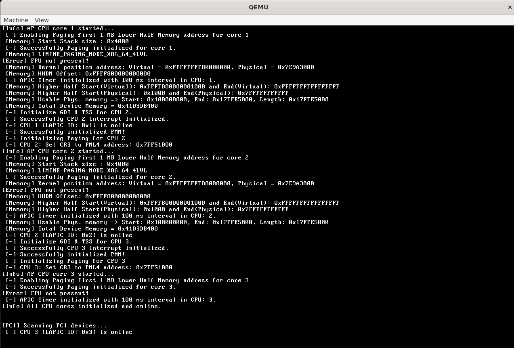

# KeblaOS

|Subject       | Value         |
|--------------|---------------|
|🏷️Version     | `1.2`        |
|🖥️Architecture| `x86`        |
|🔢Bit         | `64`         |
|📅Start Date  | `09.06.2024` |
|🔄Last Update | `10.09.2025` |

---

## Description:
This is a x86 architecture based 64 bit Operating System.

### KeblaOS Features

| Feature                    | Sub-Features / Notes                                                                  |
|----------------------------|--------------------------------------------------------------------------------------|
| ✅ 🚀**Limine Bootloader**   | Getting Various Boot Information, Getting Firmware Information                       |
| ✅ **ACPI**                | RSDT, FADT, MADT, MCFG, HPET                                                         |
| ✅ **CPU Info & Control**  | CPUID, SMP                                                                           |
| ✅ **GDT**                 | Multi-core support                                                                   |
| ✅ **TSS**                 | Multi-core support                                                                   |
| ✅ ⚡**Interrupts**          | APIC (Multi-core), PIC, ISR, IRQ                                                     |
| ✅ 🧠**Memory Management**   | Memory Info Parsing, 4-Level Paging, PMM, Kmalloc, VMM, KHEAP                        |
| ✅ ⏱️**Timers**              | TSC, RTC, PIT, APIC, ⚠️ HPET (Not Using)                                            |
| ✅ **Multitasking**        | Process, Thread, Scheduler, CPU State Handling, Multi-core Multitasking              |
| ✅ **Kernel Shell (kshell)** | Calculator, Steam Locomotive Animation                                             |
| ✅ 📂**Filesystem**          | FAT32 (via FatFs, ⚠️ Issues in implementation), VFS Layer                            |
| ✅ **System Calls**        | Interrupt-based (Using), MSR-based (Not Using)                                       |
| ✅ **User Mode Switching** | ELF Loader, Binary Loader, minimal libc,stemcall                                     |
| ✅ 🔌**Drivers**             | 🎴PCI, AHCI SATA Disk, VGA Framebuffer, I/O Ports, Serial, Keyboard, Speaker, Mouse    |
| ✅ 📦**External Libraries**  | [FatFs-R0.15b](https://elm-chan.org/fsw/ff/), [Limine-9.2.3](https://codeberg.org/Limine/Limine), [tiny-regex-c](https://github.com/kokke/tiny-regex-c) |

---

#### Used Tools Version :
- [x] [Limine Bootloader](https://github.com/limine-bootloader/limine) - 9.2.3
- [x] [x86_64-elf-gcc](https://wiki.osdev.org/GCC_Cross-Compiler) (GCC) 14.2.0
- [x] GNU ld (GNU Binutils) 2.43
- [x] [GNU Make](https://www.gnu.org/software/make/manual/make.html) 4.3
- [x] [bison](https://www.gnu.org/software/bison/manual/) (GNU Bison) 3.8.2
- [x] flex 2.6.4
- [x] [xorriso](https://www.gnu.org/software/xorriso/) 1.5.6
- [x] NASM version 2.16.01
- [x] [GNU gdb](https://www.sourceware.org/gdb/documentation/) (Ubuntu 15.0.50.20240403-0ubuntu1) 15.0.50.20240403-git
- [x] [FatFs](https://elm-chan.org/fsw/ff/00index_e.html) R0.15b Library
- [x] [QEMU emulator](https://www.qemu.org/) 8.2.2 (Debian 1:8.2.2+ds-0ubuntu1.9)
- [x] [WSL](https://learn.microsoft.com/en-us/windows/wsl/install) 2.5.10.0
- [x] [mkfs](https://www.man7.org/linux/man-pages/man8/mkfs.8.html) util-linux 2.39.3
- [x] [parted](https://www.gnu.org/software/parted/manual/parted.html) (GNU parted) 3.6
- [x] sync (GNU coreutils) 9.4
- [x] mount from util-linux 2.39.3 (libmount 2.39.3: selinux, smack, btrfs, verity, namespaces, idmapping, statx, assert, debug)

---

`src` directory is containing source code. `build` directory is containing generated object file, binary file and iso file. `iso_root` is required for building `image.iso` file.

To build and run by QEmu iso `make -B`.
To get Make help by `make help`

Downloaded from [here](https://github.com/baponkar/KeblaOS/releases).

---

© 2025 baponkar. All rights reserved except externel library used.

