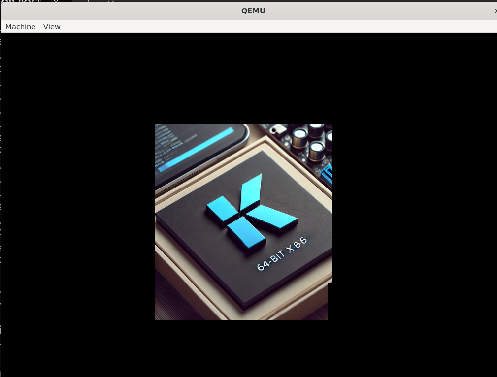

# 🖥️ KeblaOS

------------------------------------------------------
# Kebla OS

### Project Timeline
- **Start Date**: 9th June, 2024
- **Last Update**: 15th March, 2025

---

### ✅ Current Progress
- **Bootloader**: Limine Bootloader
- **Display**: VGA Framebuffer Initialization
- **ACPI Components**:
  - RSDP, RSDT/XSDT, FADT, MADT, AHCI, PCI, CMOS, RTC
- **System Initialization**:
  - GDT (Multi-Core Support)
  - IDT (Multi-Core Support): PIC, APIC
- **Timers**:
  - PIT, HPET, RTC, APIC, TSC
- **Drivers**:
  - VGA, VGA Window Manager, Keyboard, Ports, Speaker, Mouse Driver
- **Scheduler and Process Management**
- **Memory Management**:
  - Kmalloc, PMM, 4-Level 4KB Paging, VMM, KHEAP (Dynamic Kernel Heap Allocation), umalloc, UHEAP
- **Standard Library**:
  - stdio, stdlib, math, string, assert

------------------------------------------------------

## 🌟 Introducing KeblaOS

KeblaOS is an innovative and cutting-edge operating system, crafted entirely in C. It celebrates the rich technological heritage of India while pushing the boundaries of modern computing.

### 🎯 Why KeblaOS?
- **Made in India**: Empowering local talent and innovation.
- **C Language Power**: Efficient and performance-driven.
- **Community Collaboration**: Open-source and community-driven.
- **Flexible and Secure**: Customization with a focus on stability and security.

### 🚀 Features and Goals
- **Simplicity & Efficiency**: Lightweight architecture.
- **Customization**: Flexible configuration.
- **Robust Security**: Stable and secure environment.
- **Cultural Integration**: Reflecting Indian technological aspirations.

### 🤝 Get Involved
Join us in building a revolutionary OS. Whether you're a seasoned developer or an enthusiast, your contribution can make a significant impact.

### 📍 How to Contribute
- **Code Contributions**: Help build core components.
- **Feedback & Ideas**: Participate in brainstorming sessions.
- **Promotion**: Spread the word about KeblaOS.

### 📚 Resources
- [Latest Version Info](./version_info.md)
- [Tutorials and Notes](./notes/note-main.md)
- [References](./notes/Reference.md)
- [Releases](https://github.com/baponkar/KeblaOS/releases/)

---

© 2024 KeblaOS Project. All rights reserved.

