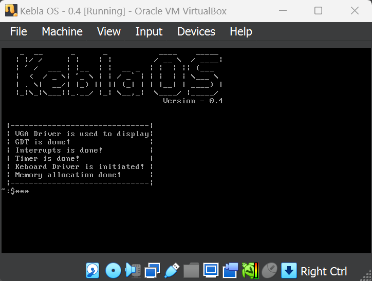

[](https://github.com/baponkar/KeblaOS)
[](https://gitlab.com/funofphysics/KeblaOS)
[
](https://kernel.com)


# Kebla OS

Version - 0.4





### Introducing the KeblaOS Operating System

Are you passionate about contributing to an innovative and ground-breaking project? Join us in developing an Indigenous Operating System (KeblaOS) crafted entirely in C and required Assembly, celebrating the rich technological heritage of India while paving the way for future advancements.

#### Why KeblaOS?

1. **Made in India**: A project close to home, fostering local talent and innovation.
2. **C Language**: Leveraging the power and efficiency of C, a language known for its performance and control.
3. **Community-Driven**: Collaborate with a dedicated community of developers who share a vision for an open, efficient, and robust operating system.
4. **Open Source**: Contribute to an open-source project where your expertise and creativity can make a real impact.

#### Features and Goals

### Introducing the KeblaOS Operating System

Are you passionate about contributing to an innovative and ground-breaking project? Join us in developing an Indigenous Operating System (KeblaOS) crafted entirely in C, celebrating the rich technological heritage of India while paving the way for future advancements.

#### Why KeblaOS?

1. **Made in India**: A project close to home, fostering local talent and innovation.
2. **C Language**: Leveraging the power and efficiency of C, a language known for its performance and control.
3. **Community-Driven**: Collaborate with a dedicated community of developers who share a vision for an open, efficient, and robust operating system.
4. **Open Source**: Contribute to an open-source project where your expertise and creativity can make a real impact.

#### Features and Goals
- **Simplicity and Efficiency**: Building a streamlined, efficient OS with minimal overhead.
- **Customization and Flexibility**: Providing users and developers with extensive customization options.
- **Security and Stability**: Ensuring a secure and stable environment for various applications.
- **Cultural Integration**: Reflecting the unique aspects of Indian culture and technological aspirations.

#### Get Involved

We invite developers, enthusiasts, and visionaries to join us on this exciting journey. Whether you're an experienced programmer or just starting, your contribution can help shape the future of KeblaOS.

### How to Join

- **Contribute to the Codebase**: Help us build and refine the core components.
- **Share Ideas and Feedback**: Participate in discussions and brainstorm sessions.
- **Spread the Word**: Help us reach a broader audience by sharing our mission.

Together, let's create something remarkable. Join the KeblaOS project and be part of a legacy that blends tradition with innovation.

# Required software for building KeblaOS

* nasm : Compile assembly (asm) code
* gcc  : Compile C, C++, Fortran code
* qemu :
* qemu-kvm :
* libvirt-daemon-system :
* libvirt-clients :
* bridge-utils :
* xx2 : to look inside of a binary file
* grub2 : to build iso with grub2 enabled  bootloader 
* make  : To automate building process

```bash
#Update package
sudo apt update -y

#Upgrade package
sudo apt upgrade -y

#Installing nasm
sudo apt install nasm

#Installing gcc
sudo apt install gcc

#Installing Qemu
sudo apt install qemu qemu-kvm libvirt-daemon-system libvirt-clients bridge-utils

#Start Services
sudo systemctl start libvirtd
sudo systemctl enable libvirtd

#Verify installation
qemu-system-x86_64 --version

#Installing xxd
sudo apt install xxd

#Installing GRUB2
sudo apt-get install grub2

#Instaling make
sudo apt install make

```

Generally Build Directory is containing the iso image of KeblaOS but we can generate the iso by  `Makefile` and using `make -B` command.Autometically the above command will generate and run the iso by Qemu.

[⬇️ Download](https://github.com/baponkar/KeblaOS/releases)


Reference : 

My Notes in [here](./My-Notes/Note.md)


----------------------------------------------------


For this project I have created following 
1. [Learning C Programming Language](https://baponkar.github.io/Learning-C/)

2. [Learning Assembly Programming Language]()


Reference : 


* Operating System Building :

    - [Writing a Simple Operating System from Scratch](./pdf/writing_simple_os.pdf)

    - [Modern X86 Assembly Language Programming by Daniel Kusswurm](./pdf/Modern%20X86%20Assembly%20Language%20Programming.pdf)


    - [The Little Book about OS Development by Erik Helin and Adam Renberg](./pdf/The%20Little%20Book%20about%20OS%20Development%20by%20Erik%20Helin%20and%20Adam%20Renberg.pdf)


    - [Modern Operating Systems by Andrew Tanenbaum](./pdf/Andrew%20S.%20Tanenbaum%20-%20Modern%20Operating%20Systems.pdf)

    - [Andrew S. Tanenbaum - Operating Systems. Design and Implementation](./pdf/Andrew%20S.%20Tanenbaum%20-%20Operating%20Systems.%20Design%20and%20Implementation.pdf)


* Programming Language :


   - [Assembly Language Step-by-Step: Programming with Linux by Jeff Duntemann](./pdf/394.Assembly%20Language%20Step-by-step_%20Programming%20with%20DOS%20and%20Linux%20with%20CD-ROM.pdf)


    - [The C Programming Language by Kernighan and Ritchie](./pdf/The%20ANSI%20C%20Programming%20Language%20by%20Brian%20W.%20Kernighan,%20Dennis%20M.%20Ritchie.pdf)


* Building Unix Based OS :

    - [The Design of the UNIX Operating System by Maurice Bach](./pdf/The%20Design%20of%20the%20UNIX%20Operating%20System%20by%20Maurice%20Bach.pdf)

* Building Linux Based OS :

    - [Linux From Scratch](./pdf/LFS-BOOK-12.1.pdf)

    - [Linux® Command Line and Shell Scripting Bible](./pdf/Wiley.Linux.Command.Line.and.Shell.Scripting.Bible.May.2008.pdf) by Richard Blum .


    - [Linux Kernal Development](./pdf/Linux.Kernel.Development.3rd.Edition.pdf) by Robert Love .

    - Linux Kernal Source : [here](https://www.kernel.org/) .

    - Building Linux Based OS from [GitHub](https://gist.github.com/bluedragon1221/a58b0e1ed4492b44aa530f4db0ffef85)


* Online Tutorials

    - [littleosbook](https://littleosbook.github.io) from GitHub

    - [OSdev Notes](https://github.com/dreamportdev/Osdev-Notes) from GitHub.

    - [OS tutorial](https://github.com/cfenollosa/os-tutorial) from GitHub.

    - [intermezzoS](https://github.com/intermezzOS/book/tree/master) Book from GitHub.

    - [kernelnewbies.org](https://kernelnewbies.org/) 

    - Guide to Build an Operating System From Scratch by [geeksforgeeks.org](https://www.geeksforgeeks.org/guide-to-build-an-operating-system-from-scratch/)

    - [BrokenThorn Entertainment OS Development Series](https://github.com/enygmator/os_dev.tutorials.brokenthorn)

    - [How computer bootup](https://manybutfinite.com/post/how-computers-boot-up/)

    - [ The Kernel Boot Process](https://manybutfinite.com/post/kernel-boot-process/)

    - [Boot Sequence](https://wiki.osdev.org/Boot_Sequence) from wiki.osdev.org

    - [createyourownos.blogspot.com](https://createyourownos.blogspot.com/)


    - [wiki.osdev.org](https://wiki.osdev.org)


* Video Tutorials :

    - YouTube tutoarial by OliveStem [x86 Assembly with NASM](https://www.youtube.com/watch?v=yBO-EJoVDo0&list=PL2EF13wm-hWCoj6tUBGUmrkJmH1972dBB).

    - This [Youtube](https://youtu.be/MwPjvJ9ulSc?si=lRM8mZZy3EkVZ36J) Videos.

    - [Write your own pkOS](https://www.youtube.com/watch?v=NtZzb9ZJ5Fo&list=PL3Kz_hCNpKSTFCTJtP4-9mkYDVM7rAprW)

 * Example OS:

    - [Jazz2-OS](https://gitlab.com/olivestem/Jazz2-0)

    - [pkOS](https://docs.pkos.pagekey.io/blog/) tutorial

    - [FlingOS](https://github.com/FlingOS/FlingOS/tree/develop) from GitHub.

    - intermezzoS [GitHub](https://github.com/intermezzOS)

    - [CavOS](https://github.com/malwarepad/cavOS)

    - [KolibriOS](https://kolibrios.org/en/)

    - [skift OS](https://github.com/skift-org/skift)

    - [web.archive.org](https://web.archive.org/web/20160412174753/http://www.jamesmolloy.co.uk/tutorial_html/index.html)


----------------------------------------------------------------------------------
###### First date of Journey : 9th June, 2024
###### Last Update : 8th September, 2024
###### Developer : [baponkar](https://github.com/baponkar)
----------------------------------------------------------------------------------

© 2024 KeblaOS Project. All rights reserved.

