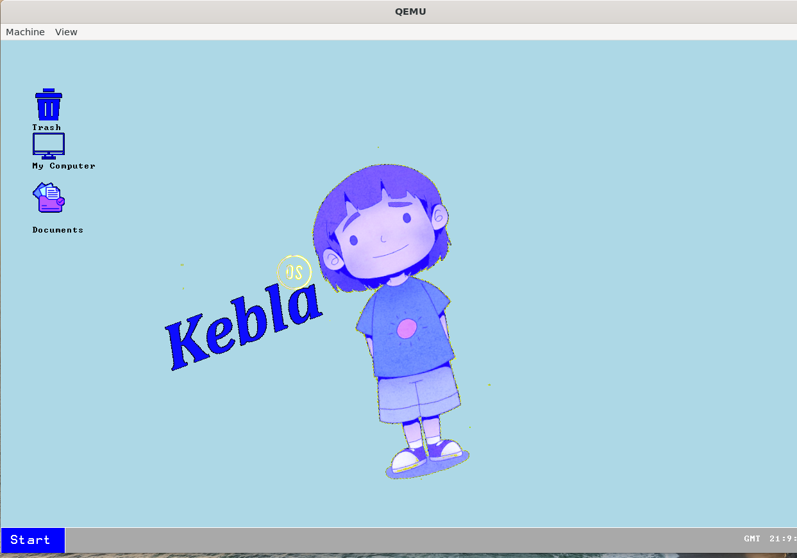

# KeblaOS

|Subject       | Value         |
|--------------|---------------|
|🏷️Version     | `1.1`        |
|🖥️Architecture| `x86`        |
|🔢Bit         | `64`         |
|📅Start Date  | `09.06.2024` |
|🔄Last Update | `14.09.2025` |

---

## Description:
This is a x86 architecture based 64 bit Operating System.

### KeblaOS Features

| Feature                      | Sub-Features / Notes                                                                 |
|------------------------------|--------------------------------------------------------------------------------------|
| ✅ 🚀**Limine Bootloader**  | Getting Various Boot Information, Getting Firmware Information                       |
| ✅ **ACPI**                  | RSDT, FADT, MADT, MCFG, HPET                                                         |
| ✅ **CPU Info & Control**    | CPUID, SMP                                                                           |
| ✅ **GDT**                   | Multi-core support                                                                   |
| ✅ **TSS**                   | Multi-core support                                                                   |
| ✅ ⚡**Interrupts**          | APIC (Multi-core), PIC, ISR, IRQ                                                     |
| ✅ 🧠**Memory Management**   | Memory Info Parsing, 4-Level Paging, PMM, Kmalloc, VMM, KHEAP                        |
| ✅ ⏱️**Timers**              | TSC, RTC, PIT, APIC, ⚠️ HPET (Not Using)                                            |
| ✅ **Multitasking**        | Process, Thread, Scheduler, CPU State Handling, Multi-core Multitasking                |
| ✅ **Kernel Shell (kshell)** | Calculator, Steam Locomotive Animation                                               |
| ✅ 📂**Filesystem**          | FAT32 (via FatFs, ⚠️ Issues in implementation), VFS Layer                           |
| ✅ **System Calls**        | Interrupt-based (Using), MSR-based (Not Using)                                         |
| ✅ **User Mode Switching** | ELF Loader, Binary Loader, minimal libc,stemcall                                       |
| ✅ 🔌**Drivers**             | 🎴PCI, AHCI SATA Disk, VGA Framebuffer, I/O Ports, Serial, Keyboard, Speaker, Mouse |

-------------------------------------------------------------------------------------------------------------------------

* ✅ 📦**External Libraries** :
    1. [Limine-9.2.3](https://codeberg.org/Limine/Limine)
    2. [FatFs-R0.15b](https://elm-chan.org/fsw/ff/)
    3. [tiny-regex-c](https://github.com/kokke/tiny-regex-c)
    4. [uGUI](https://github.com/achimdoebler/UGUI)
    5. [Nuklear](https://github.com/Immediate-Mode-UI/Nuklear)
    6. [LvGL](https://github.com/lvgl/lvgl)
    
    

---

#### Used Tools Version :
- [x] [Limine Bootloader](https://github.com/limine-bootloader/limine) - 9.2.3
- [x] [x86_64-elf-gcc](https://wiki.osdev.org/GCC_Cross-Compiler) (GCC) 14.2.0
- [x] GNU ld (GNU Binutils) 2.43
- [x] [GNU Make](https://www.gnu.org/software/make/manual/make.html) 4.3
- [x] [bison](https://www.gnu.org/software/bison/manual/) (GNU Bison) 3.8.2
- [x] flex 2.6.4
- [x] [xorriso](https://www.gnu.org/software/xorriso/) 1.5.6
- [x] NASM version 2.16.01
- [x] [GNU gdb](https://www.sourceware.org/gdb/documentation/) (Ubuntu 15.0.50.20240403-0ubuntu1) 15.0.50.20240403-git
- [x] [FatFs](https://elm-chan.org/fsw/ff/00index_e.html) R0.15b Library
- [x] [QEMU emulator](https://www.qemu.org/) 8.2.2 (Debian 1:8.2.2+ds-0ubuntu1.9)
- [x] [WSL](https://learn.microsoft.com/en-us/windows/wsl/install) 2.5.10.0
- [x] [mkfs](https://www.man7.org/linux/man-pages/man8/mkfs.8.html) util-linux 2.39.3
- [x] [parted](https://www.gnu.org/software/parted/manual/parted.html) (GNU parted) 3.6
- [x] sync (GNU coreutils) 9.4
- [x] mount from util-linux 2.39.3 (libmount 2.39.3: selinux, smack, btrfs, verity, namespaces, idmapping, statx, assert, debug)

---

## System Call:

- General System Call:

    1. `int syscall_keyboard_read(uint8_t *buffer, size_t size)`
    2. `int syscall_print(const char *msg)`
    3. `int syscall_exit()`
    4. `int syscall_print_rax()`

    5. `uint64_t syscall_uheap_alloc(size_t size, enum allocation_type type);`
    6. `uint64_t syscall_uheap_free(void *ptr, size_t size);`

- FatFs File Manage: 

    7. `int64_t syscall_vfs_mkfs(int fs_type, char *disk);`
    8. `nt64_t syscall_vfs_init(char *fs_name);`
    9. `uint64_t syscall_mount(char *path);`
    10. `uint64_t syscall_open(const char *path, uint64_t flags);`
    11. `uint64_t syscall_close(void *file);`
    12. `uint64_t syscall_read(void *file, uint64_t offset, void *buf, uint32_t size);`
    13. `uint64_t syscall_write(void *file, uint64_t offset, void *buf, uint32_t btw);`

    14. `uint64_t syscall_lseek(void *file, uint32_t offs);`
    15. `uint64_t syscall_unlink(char *path);`

- FatFs Directory Manage:

    16. `uint64_t syscall_opendir(const char *path);`
    17. `uint64_t syscall_closedir(void * dir_ptr);`
    18. `uint64_t syscall_readdir(void * dir_ptr);`
    19. `uint64_t syscall_mkdir(void * dir_ptr);`
    20. `int syscall_list_dir(const char* path);`
    21. `int syscall_getcwd(void *buf, size_t size);`
    22. `int syscall_chdir(const char *path);`
    23. `int syscall_chdrive(const char *path);`

- Process Manage:

    24. `void *syscall_create_process(char* process_name);`
    25. `int syscall_delete_process(void *process);`
    26. `void *syscall_get_process_from_pid(size_t pid);`
    27. `void *syscall_get_current_process();`

- Thread Manage:

    28. `void *syscall_create_thread(void* parent, const char* thread_name, void (*function)(void*), void* arg);`
    29. `void *syscall_delete_thread(void *thread);`

- Time Manage:

    30. `time_t syscall_time(time_t *t);`
    31. `int syscall_clock_gettime(int clk_id, struct timespec *tp);`
    32. `int syscall_gettimeofday(struct timeval *tv, struct timezone *tz);`
    33. `clock_t syscall_times(struct tms *buf);`
    34. `uint64_t syscall_get_uptime(void);`

- VGA:
    
    35. `int syscall_set_pixel(int x, int y, uint32_t color);`
    36. `uint32_t syscall_get_pixel(int x, int y);`
    37. `int syscall_cls_color();`
    38. `int syscall_display_image( int x, int y, const uint64_t* image_data, int img_width, int img_height);`
    39. `int syscall_display_transparent_image( int x, int y, const uint64_t* image_data, int img_width, int img_height);`

Before building set GCC , LD, OBJDUMP, 
`src` directory is containing source code. `build` directory is containing generated object file, binary file and iso file. `iso_root` is required for building `image.iso` file.

To build and run by QEmu iso `make -B`.
To get Make help by `make help`

Downloaded from [here](https://github.com/baponkar/KeblaOS/releases).

---

© 2025 baponkar. All rights reserved except externel library used.

