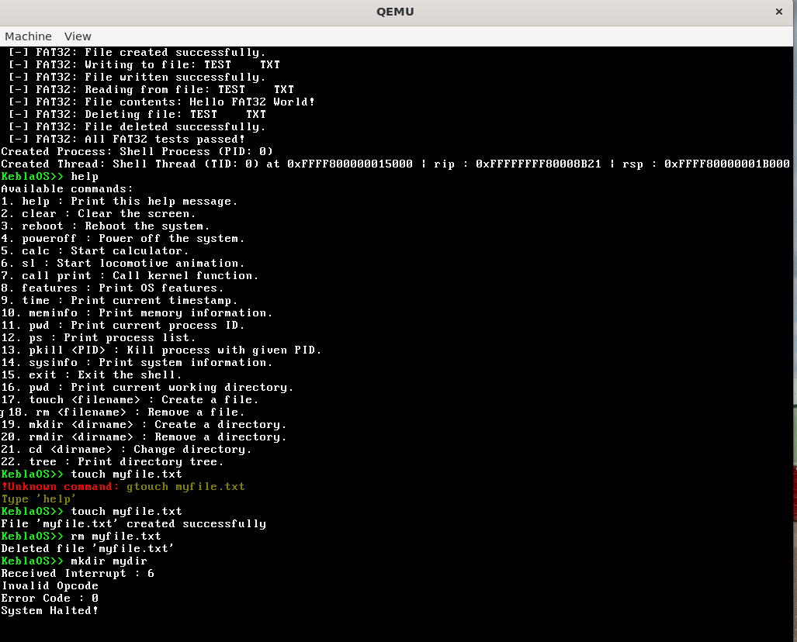
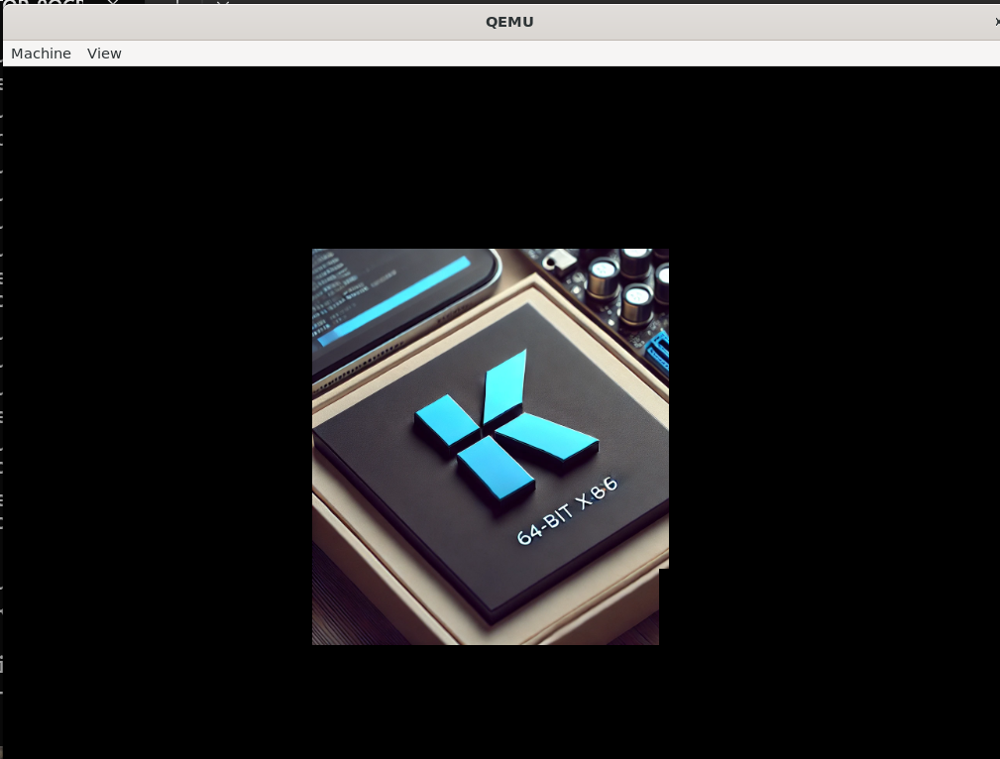

# 🖥️ KeblaOS

<table>
  <tr><td colspan="2" align="left"><em>Version - 0.17.5</em></td></tr>
  <tr><td><em>Architecture :</em></td><td><em>x86 (IA-32) </em></td></tr>
  <tr><td><em>Bit :</em></td><td><em>64</em></td></tr>
  <tr><td><em>Build Date :</em></td><td><code>17.07.2025</code></td></tr>
</table>

----

## Features : This version have following features :

- [x] Limine Bootloader
    * Getting Various Boot Information
    * Getting Firmware Information

- [x] VGA Framebuffer Driver
    * Additional functions

- [x] ACPI
    * RSDT
    * FADT
    * MADT
    * MCFG
    * HPET

- [x] AHCI
    * AHCI SATA Disk Driver

- [x] CPU information and control
    * CPUID
    * SMP

- [x] GDT (Multi Core Support)
- [x] TSS (Multi Core Support)

- [x] Interrupt
    * APIC (Multi Core Support)
    * PIC
    * ISR
    * IRQ

- [x] PCI

- [x] Memory Management
    * Parsing Memory Info
    * 4 Level Paging
    * PMM
    * Kmalloc
    * VMM
    * KHEAP

- [x] Drivers
    * AHCI Disk Driver
    * VGA FRAMEBUFFER
    * I/O PORTS
    * SERIAL
    * Keyboard
    * Speaker
    * Mouse

- [x] Timer
    * TSC
    * RTC
    * PIT
    * APIC
    * HPET (Not Using)

- [x] Multitasking
    * Process
    * Thread
    * Scheduler
    * Set CPU State by regisers

- [x] Simple Interactive Kernel Shell (kshell)
    * Calculator
    * Steam Locomotive animation

- [x] Multitasking
    * Multitasking by enabling all cores

- [x] Filesystem
    * FAT32 File System from FatFs Library(Problem in implementation)
    * ext2 Filesystem (Working)
    * VFS Layer

- [x] Interrupt Based System Call (Software Interrupt)

- [x] Switching into User Mode
    * MSR Based System Call (Currently Not using)
    * Interrupt Based System Call (Using in this version)
    * Loading ELF, Binary File

Screenshot 1

Screenshot 2

Screenshot 3

Screenshot 4

## Used Tools Version :
- [x] [Limine Bootloader](https://github.com/limine-bootloader/limine) - 8.6.0
- [x] [x86_64-elf-gcc](https://wiki.osdev.org/GCC_Cross-Compiler) (GCC) 14.2.0
- [x] GNU ld (GNU Binutils) 2.43
- [x] GNU Make 4.3
- [x] bison (GNU Bison) 3.8.2
- [x] flex 2.6.4
- [x] xorriso 1.5.4
- [x] NASM version 2.15.05
- [x] GNU gdb (Ubuntu 12.1-0ubuntu1~22.04.2) 12.1
- [x] [FatFs](https://elm-chan.org/fsw/ff/00index_e.html) R0.15b Library
- [x] [QEMU emulator](https://www.qemu.org/) version 6.2.0 (Debian 1:6.2+dfsg-2ubuntu6.24)
- [x] [WSL](https://learn.microsoft.com/en-us/windows/wsl/install) Ubuntu 22.04.4 LTS

`src` directory is containing source code. `build` directory is containing generated object file, binary file and iso file. `iso_root` is required for building `image.iso` file.

To build and run by QEmu iso `make -B`.
To get Make help by `make help`

Downloaded from [here](https://github.com/baponkar/KeblaOS).

