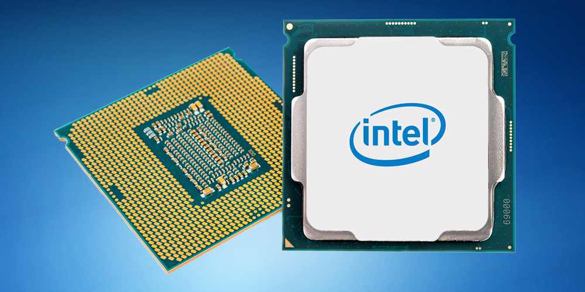

--------------------------------------------------------

# CPU

# A Deep Dive into Processors: The Heart of Modern Computing

Processors, often referred to as the **Central Processing Unit (CPU)**, are the beating heart of every computing device, from your smartphone to the most powerful supercomputer. They are responsible for executing instructions, performing calculations, and managing data, making them indispensable in the digital age. This article explores what processors are, how they work, and their evolution over time.

## What Is a Processor?

A **processor** is a microchip embedded in a computing device that carries out instructions from a computer program. It processes input data and outputs results, executing everything from simple arithmetic operations to complex algorithms. The processor is responsible for the majority of a computer's computations and controls nearly all tasks performed by a system.

### Key Components of a Processor:
1. **Control Unit (CU)**: Directs the operation of the processor by fetching instructions from memory, decoding them, and executing them.
2. **Arithmetic Logic Unit (ALU)**: Handles mathematical calculations (like addition, subtraction) and logical operations (such as AND, OR).
3. **Registers**: Small, fast storage locations within the processor used to store data temporarily during execution.
4. **Cache**: A small but extremely fast memory located close to the processor, storing frequently accessed data to speed up operations.
5. **Cores**: Modern processors are often multi-core, meaning they contain multiple processing units, or "cores," that can execute instructions simultaneously.

### The Processor's Cycle:
- **Fetch**: The CPU retrieves an instruction from memory.
- **Decode**: The instruction is translated into signals that can be executed.
- **Execute**: The ALU or other components perform the instruction.
- **Store**: The result of the execution is written back to memory or registers.

This sequence is known as the **instruction cycle** or **fetch-decode-execute cycle** and happens millions or even billions of times per second in modern processors.

---

## Evolution of Processors

The history of processors is a fascinating journey of innovation and progress. Over the years, processors have evolved in terms of complexity, speed, and functionality, allowing computers to become smaller, faster, and more efficient.

### 1. **The Early Days (1940s - 1960s)**
The first processors were mechanical, such as the **ENIAC** (Electronic Numerical Integrator and Computer) built in the 1940s. These early systems were massive and consumed huge amounts of electricity. However, the invention of the **transistor** in 1947 paved the way for smaller and faster electronic processors.

In the 1960s, **Integrated Circuits (ICs)** revolutionized the world of processors, allowing multiple transistors to be embedded onto a single silicon chip.

### 2. **The Microprocessor Revolution (1970s - 1980s)**
The release of **Intel's 4004** microprocessor in 1971 marked the birth of the modern processor. The Intel 4004 was the first commercially available microprocessor, containing 2,300 transistors and capable of processing 4 bits of data at a time.

By the late 1970s and early 1980s, 8-bit and 16-bit processors such as the **Intel 8080** and **Intel 8086** became the foundation for personal computing. The **x86 architecture**, introduced by Intel during this time, continues to dominate the PC market today.

### 3. **Rise of Multi-Core Processors (2000s - Present)**
By the 2000s, processor manufacturers like Intel and AMD hit a thermal and speed barrier. Simply increasing clock speeds was no longer enough to improve performance, as processors were becoming too hot and power-hungry. The solution was to move towards **multi-core** designs, where multiple processor cores could work on tasks in parallel.

- **Dual-core** and **quad-core** processors became standard in personal computers, followed by **octa-core** and higher designs in high-end machines.
- This approach allowed significant gains in performance without excessively increasing power consumption.

### 4. **Modern Processors and the Future**
Today’s processors feature **hyper-threading**, **parallel computing**, and **AI-optimized cores**. Technologies like **ARM** (used in smartphones and embedded devices) focus on power efficiency, while **x86** processors are optimized for performance.

The future of processors is likely to involve:
- **Quantum Computing**: Processors based on quantum bits (qubits) that could revolutionize computation by solving problems considered intractable by classical computers.
- **Neuromorphic Computing**: Processors that mimic the structure and operation of the human brain to improve AI and machine learning capabilities.

---

## Types of Processors

There are various types of processors based on architecture, application, and purpose. Let’s explore the most common types:

### 1. **General-Purpose Processors**
These are the processors found in personal computers, laptops, and servers, built for handling a wide variety of tasks. **x86 processors**, like Intel's **Core** series or AMD's **Ryzen**, are common examples.

- **CISC Processors** (Complex Instruction Set Computing): These processors have a large set of instructions and can perform complex tasks with fewer instructions, commonly found in x86 architectures.
- **RISC Processors** (Reduced Instruction Set Computing): RISC processors simplify the set of instructions, allowing them to execute each instruction faster. **ARM processors**, widely used in mobile devices, are based on this architecture.

### 2. **Embedded Processors**
Embedded processors are designed for specific tasks within a larger system. You’ll find them in appliances, cars, industrial machines, and smart devices. These processors are optimized for low power consumption and dedicated tasks. **Microcontrollers** like **Arduino** and **Raspberry Pi** boards are common examples.

### 3. **Graphics Processing Units (GPUs)**
While CPUs handle general computing tasks, **GPUs** are specialized processors designed to handle graphics and image processing. Modern GPUs are incredibly powerful and are now used for non-graphics-related tasks like **cryptocurrency mining**, **machine learning**, and **AI processing** due to their ability to perform large-scale parallel computations.

### 4. **Application-Specific Integrated Circuits (ASICs)**
ASICs are custom-built processors designed for a particular application or task. They are incredibly efficient but lack flexibility, as they can only perform the tasks they were designed for. **Bitcoin mining** machines, for example, often use ASICs.

### 5. **Digital Signal Processors (DSPs)**
**DSPs** are specialized processors optimized for handling real-time processing of signals, such as audio, video, or radar data. They are used in applications like smartphones, communication devices, and audio equipment to perform tasks like compression, filtering, and modulation.

---

## Performance Metrics of Processors

When evaluating the performance of a processor, several key metrics are commonly considered:

### 1. **Clock Speed**
Measured in **GHz** (Gigahertz), clock speed indicates how many cycles per second a processor can perform. A higher clock speed generally means a faster processor, but it’s not the only factor to consider.

### 2. **Core Count**
The number of cores in a processor dictates how many tasks it can handle in parallel. A **quad-core** processor can process four instructions simultaneously, improving performance in multi-threaded applications.

### 3. **Cache Size**
Processors contain a small amount of fast memory known as **cache**. Larger caches can store more data close to the CPU, reducing the need to access slower main memory and thus speeding up computations.

### 4. **Instructions Per Cycle (IPC)**
IPC refers to the number of instructions a processor can execute in one clock cycle. Processors with higher IPC are generally more efficient, executing more work per cycle.

### 5. **Thermal Design Power (TDP)**
TDP measures the amount of heat a processor generates under full load, expressed in watts. Processors with a high TDP require better cooling solutions and tend to consume more power.

---

## Conclusion

Processors are the most critical component in any computer system, dictating its performance and capabilities. Over the decades, processors have evolved from simple, single-core units to complex, multi-core powerhouses capable of handling demanding tasks like AI processing and 3D rendering. As technology advances, we can expect processors to continue improving in speed, efficiency, and specialization, driving innovation in fields ranging from gaming to artificial intelligence and beyond.

Understanding the different types of processors and their architectures is essential for anyone interested in computer systems, allowing them to make informed decisions when selecting hardware or optimizing software. Whether you’re a developer, a gamer, or a casual computer user, processors are central to your digital experience.

-------------------------------------------------------
*© 2024 KeblaOS Project. All rights reserved.*