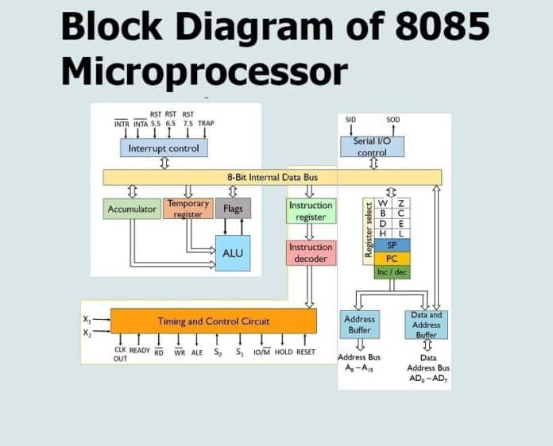
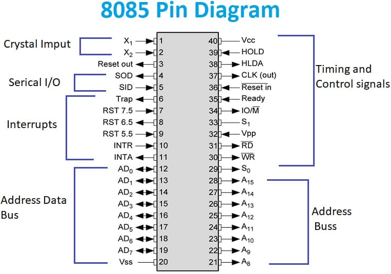
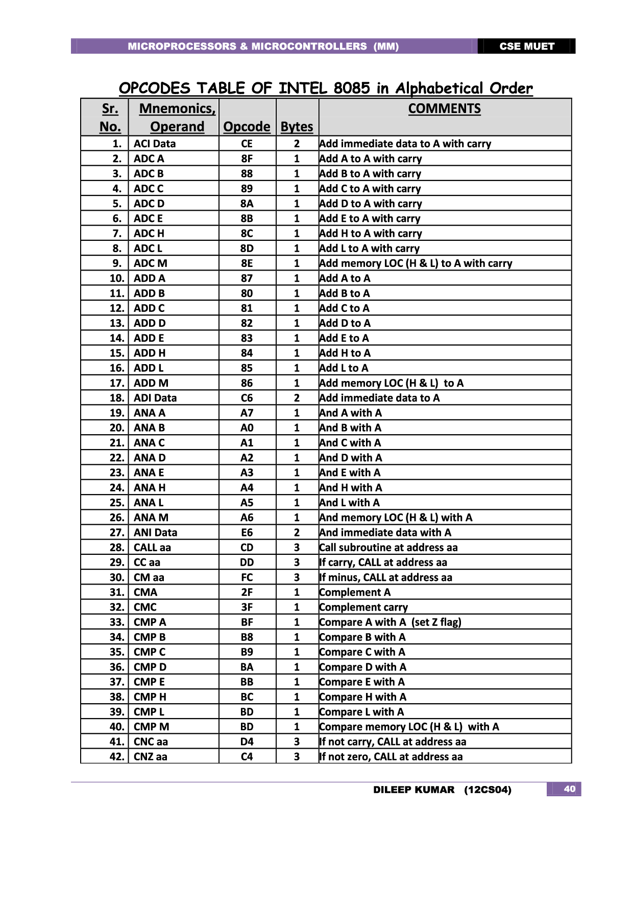

-----------------------------------------------------------------------------------------

# 8085 Processor

[Online 8085 Simulator](https://www.sim8085.com/) .

Example :

1. Addition of two hex numbers (or 8 bit number) and storing the numbers for future use

| Address | Instruction | Hex Code | Comments                                  |
|---------|-------------|----------|-------------------------------------------|
| E000    | MVI A, 49H  | 3E       | Store 49H in A                            |
| E001    |             | 49       |                                           |
| E002    | MOV B, A    | 47       | Copy the contents of A to B               |
| E003    | STA, E050H  | 32       | Store the contents of A in location E050H |
| E004    |             | 50       | location E050H                            |
| E005    |             | E0       |                                           |
| E006    | MVI A, 56H  | 3E       | Store 56H in A                            |
| E007    |             | 56       |                                           |
| E008    | STA, E051H  | 32       | Copy the contents of A                    |
| E009    |             | 51       | in location E051H                         |
| E010    |             | E0       |                                           |
| E011    | ADD B       | 80       | Perform A + B and store the result in A   |
| E012    | RST 1       | CF       | Ends the Program.                         |

## Boolean Algebra

0 + 0 = 0

0 + 1 = 1

1 + 1 = 10

0.0 = 0

1.0 = 0

0.1 = 0

1.1 = 1

(A + B)' = A'.B'

(A.B)' = A' + B'

# Logic Gates and Flip-Flop Input/Output Tables

## OR Gate
| A | B | A OR B |
|---|---|--------|
| 0 | 0 |   0    |
| 0 | 1 |   1    |
| 1 | 0 |   1    |
| 1 | 1 |   1    |

## AND Gate
| A | B | A AND B |
|---|---|---------|
| 0 | 0 |    0    |
| 0 | 1 |    0    |
| 1 | 0 |    0    |
| 1 | 1 |    1    |

## NOT Gate
| A | NOT A |
|---|-------|
| 0 |   1   |
| 1 |   0   |

## Ex-OR (XOR) Gate
| A | B | A ⊕ B |
|---|---|-------|
| 0 | 0 |   0   |
| 0 | 1 |   1   |
| 1 | 0 |   1   |
| 1 | 1 |   0   |

## Ex-NOR (XNOR) Gate
| A | B | A ⊙ B |
|---|---|-------|
| 0 | 0 |   1   |
| 0 | 1 |   0   |
| 1 | 0 |   0   |
| 1 | 1 |   1   |

---

# Flip-Flops

## SR Flip-Flop (Set-Reset)
| S | R | Q (Next State) | Q' (Next State) |
|---|---|----------------|-----------------|
| 0 | 0 |        Q        |       Q'        |
| 0 | 1 |        0        |       1         |
| 1 | 0 |        1        |       0         |
| 1 | 1 |    Undefined    |   Undefined     |

## JK Flip-Flop
| J | K | Q (Next State) | Q' (Next State) |
|---|---|----------------|-----------------|
| 0 | 0 |        Q        |       Q'        |
| 0 | 1 |        0        |       1         |
| 1 | 0 |        1        |       0         |
| 1 | 1 |      Toggle     |     Toggle      |

## D Flip-Flop
| D | Q (Next State) |
|---|----------------|
| 0 |        0       |
| 1 |        1       |

## T Flip-Flop (Toggle)
| T | Q (Next State) |
|---|----------------|
| 0 |        Q       |
| 1 |     Toggle     |

Reference :

1. [geeksforgeeks](https://www.geeksforgeeks.org/architecture-of-8085-microprocessor/)

2. 

-------------------------------------------------------
*© 2025 KeblaOS Project. All rights reserved.*