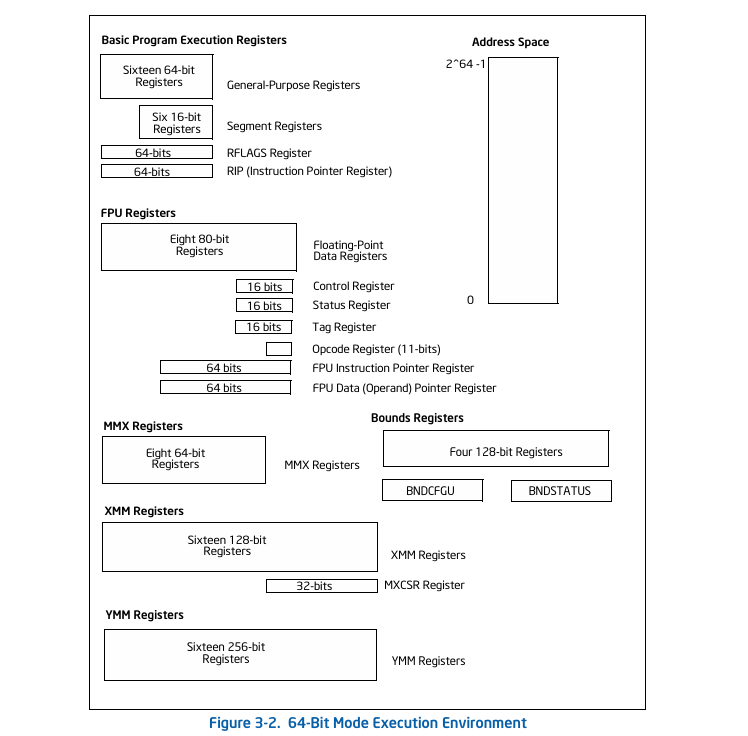

[](https://gitlab.com/baponkar/kebla-os)
[
](https://github.com/baponkar/KeblaOS)
[
](https://gitlab.com/baponkar/KeblaOS)
[
](https://kernel.com)


--------------------------------------------------------------------------------------------------------------------

This chapter's content was one of my main headech.

According [IA32 Intel Systems Programming Documentation](./pdf-docs/325462-sdm-vol-1-2abcd-3abcd-4.pdf), Volume 3A, Chapter - 3 Different types Registers in x86_64 



I have written following registers structure to store different registers states in utl.h

```c
typedef struct registers
{
    uint64_t ds, es, fs, gs;                       // Segment registers 
    uint64_t r15, r14, r13, r12, r11, r10, r9, r8; // General-purpose registers
    uint64_t rdi, rsi, rbp, rdx, rcx, rbx, rax;    // General-purpose registers

    uint64_t int_no, err_code;                     // Interrupt number and error code

    uint64_t iret_rip, iret_cs, iret_rflags, iret_rsp, iret_ss; // CPU state
} registers_t; 
```

Memory map by Limine Bootloader => Physical Memory Manager => Paging => Virtual Memory manager => Static kernel Heap => Dynamic Kernel Heap allocation.

* Physical memory Manager :

In KeblaOS I am using x86 architecture 64 Bit Flat memory Model.

Here I am using bitmap to store status of a 4KB Physical Frame. Here I am showing a basic example

```
Index         | 0| 1| 2| 3| 4| 5|....|60|61|62|63|
              ------------------------------------
nth Bit state | 0| 0| 1| 0| 0| 1|....| 0| 0| 0| 0|  64 Bit
```

Here 64 Bit valu can store 64 x 4 KB = 256 KB of memory states.

Here nth row 3rd and 5th frame are using. So here Index is n and offset are 3 and 4 respectively.

So the physical address of nth row 3rd bit = n*64*4 + 3*4 = (n*64 + 3)*4

in general from row and offset to bit_no
```
bit_no = (n*64 + offset) * frame_size
```

Oppositely I can derive row and offset from bit_no
```
row = (int) bit_no / 64
offset = (int) bit_no % 64
```


frame_size = 1KB = 1024 = 0x1000

Here I am going to implement 4Level Paging which will support 4KB Paging.So I am using 4KB Physical Frame.

So I am using following Macros

```c
#define FRAME_SIZE 0x1000
#define BIT_SIZE 64

// Converting Bit no to index and offset
#define INDEX_FROM_BIT_NO(x)(x / BIT_SIZE)
#define OFFSET_FROM_BIT_NO(x)(x % BIT_SIZE)

// Converting index and offset to bit not
#define GET_BIT_NO(index, offset)(index*BIT_SIZE+offset)

// Converting Bit no to physical start address
#define GET_FRAME_ADDRESS(bit_no)(bit_no*FRAME_SIZE)

```

The all physical frames starts from `PHYSICAL_PLACEMENT_ADDRESS` and Maximum Placebale address. Which may set by Limine Bootloader memory map

```c
#define PHYSICAL_PLACEMENT_ADDRESS 0x100000 // 1MB
#define PHYSICAL_END_ADDRESS 0x500000   // 5 MB
```
Now all physical frames allocated from PHYSICAL_PLACEMENT_ADDRESS address.


## References :

1. [jamesmolloy.uk.co](https://web.archive.org/web/20160326064341/http://jamesmolloy.co.uk/tutorial_html/3.-The%20Screen.html)

2. https://wiki.osdev.org/Memory_management

3. http://www.osdever.net/tutorials/view/memory-management-1

4. https://www.intel.com/content/www/us/en/developer/articles/technical/intel-sdm.html

5. 


------------------------------
*© 2025 KeblaOS Project. All rights reserved.*