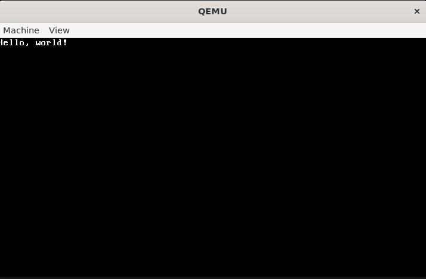

<h1 style="display: flex;flex-direction: column;color:red;font-size: 3em;align-items: center;justify-content: center;"> Kebla OS </h1>

 0.1      

Build Date : 03/10/24

--------------------------------------------------------

# Features :

* Booting by GRUB2.

* VGA TEXT 80X25 Screen Driver.

This version Kebla OS will print "Hello, World!" in VGA Text Screen.

# Output Result :

# Info :

I have installed cross compiler in $(HOME)/opt/cross/bin/i686-elf-ld directory.
To build and run by qemu`make`.

# Reference :

1. [Environment Setup](https://web.archive.org/web/20160326062945/http://jamesmolloy.co.uk/tutorial_html/1.-Environment%20setup.html)

2. [Genesis](https://web.archive.org/web/20160326060959/http://jamesmolloy.co.uk/tutorial_html/2.-Genesis.html)

3. [The Screen](https://web.archive.org/web/20160326064341/http://jamesmolloy.co.uk/tutorial_html/3.-The%20Screen.html)

4. [VGA Hardware](https://wiki.osdev.org/VGA_Hardware)

--------------------------------------------------------

#### Developed by : [baponkar](https://github.com/baponkar)

*© 2024 [KeblaOS](https://github.com/baponkar/KeblaOS) Project. All rights reserved.*

