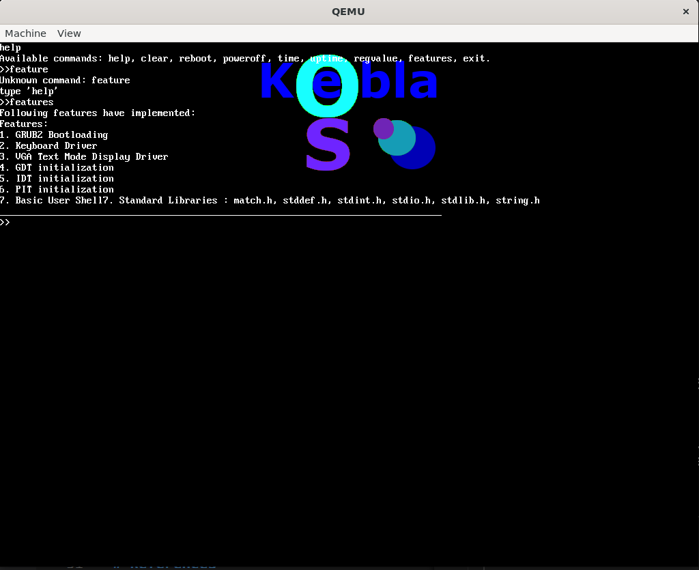

# KeblaOS
## Architecture : x86_64 bit
## Version - 0.3
## Build Date : 03/11/2024

## Features :

* Limine Bootloading with customization 
* VGA Video Mode Driver Initialization
    - Text Printing by using  8x8 and 8x16 font array
    - Image Display by using image array
* GDT Initialization
* IDT Initialization
* PIC Timer Initialization
* Add some standard library functions
    - math.h
    - stio.h
    - stdlib.h
    - string.h
* Automated Building by Makefile
* Update register_t struct
* Keyboard Driver implementation
* User Shell Implementation
* Paging Implementation

## Screenshot

# References

* [Limine Bare Bones](https://wiki.osdev.org/Limine_Bare_Bones)
* [Limine Bootloader Github](https://github.com/limine-bootloader/limine)
* [Global Descriptor Table](https://wiki.osdev.org/Global_Descriptor_Table)
* [GDT Tutorials](https://wiki.osdev.org/GDT_Tutorial)
* [Interrupt Descriptor Table](https://wiki.osdev.org/Interrupt_Descriptor_Table)
* [Interrupt Handling on x86_64](https://github.com/dreamportdev/Osdev-Notes/blob/master/02_Architecture/05_InterruptHandling.md)
* [PIC](https://wiki.osdev.org/8259_PIC)
* [PS2 Keyboard](https://wiki.osdev.org/PS/2_Keyboard)
* [Paging in wiki.osdev.org](https://wiki.osdev.org/Paging)
* [Memory Management from Osdev-Notes](https://github.com/dreamportdev/Osdev-Notes/tree/master/04_Memory_Management)
