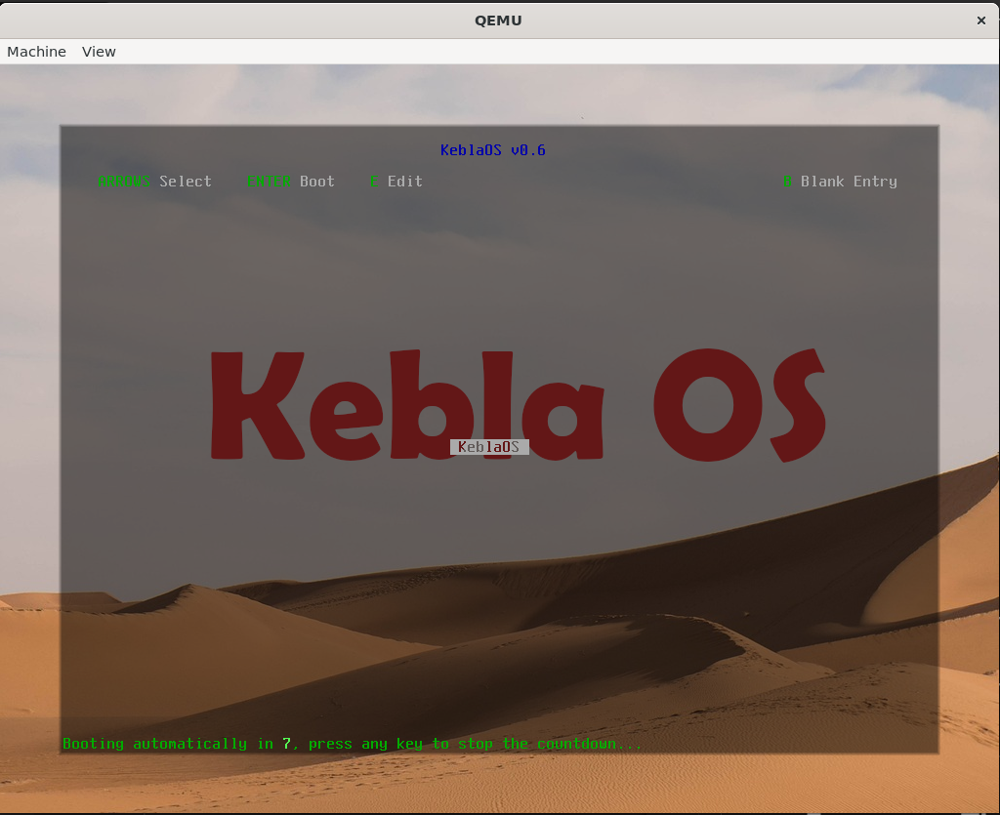
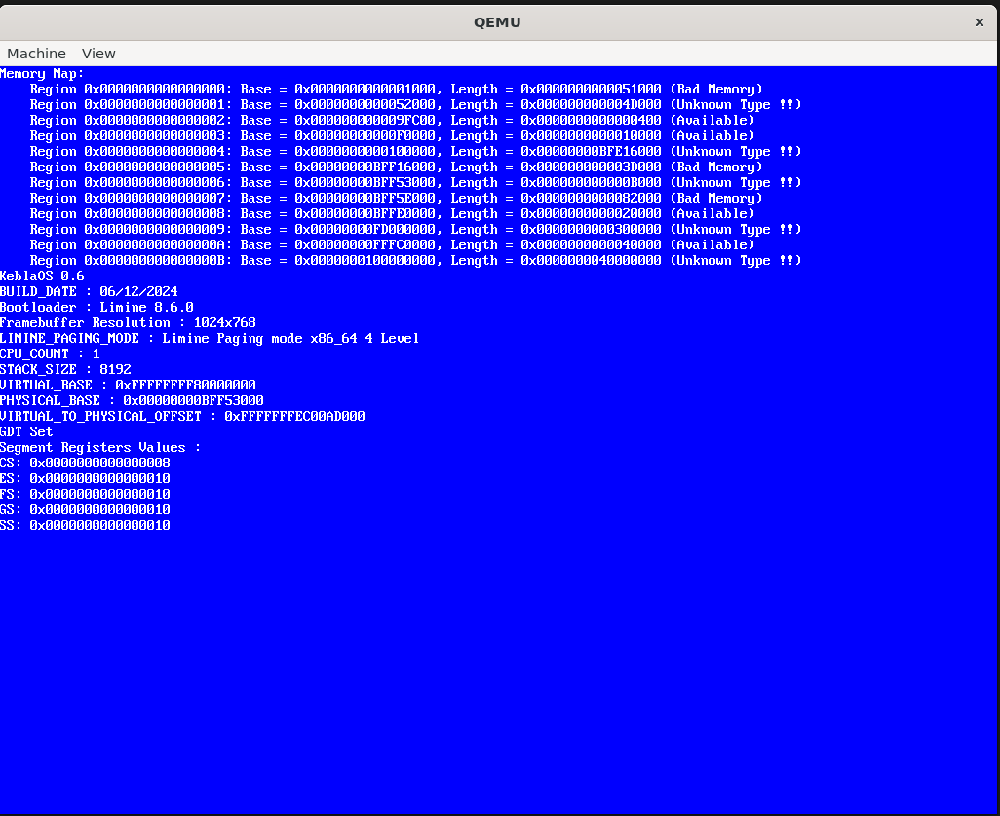

# KeblaOS

## Version - 0.6

## Architecture : x86_64

## Build Date : 08/12/2024

## Description : This version just print some bootloader supplied information.

Screenshot 1

Screenshot 2

## Used Tools Version :
- [x] [Limine Bootloader](https://github.com/limine-bootloader/limine) - 8.6.0
- [x] [x86_64-elf-gcc](https://wiki.osdev.org/GCC_Cross-Compiler) (GCC) 14.2.0
- [x] GNU ld (GNU Binutils) 2.43
- [x] [QEMU emulator](https://www.qemu.org/) version 6.2.0 (Debian 1:6.2+dfsg-2ubuntu6.24)
- [x] [WSL](https://learn.microsoft.com/en-us/windows/wsl/install) Ubuntu 22.04.4 LTS

## Features : This version have following features :

- [x] Limine Bootloader
- [x] VGA Framebuffer Driver
- [x] stdlib.c included in lib directory
- [x] string.c includeed in lib directory
- [x] Global Descriptor Table(GDT)

`src` directory is containing source code. `build` directory is containing generated object file, binary file and iso file. `iso_root` is required for building `image.iso` file.

To build and run by QEmu iso `make -B`.

Downloaded from [here](https://github.com/baponkar/KeblaOS).